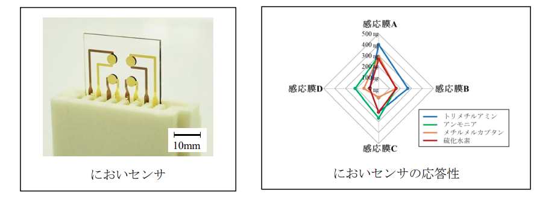
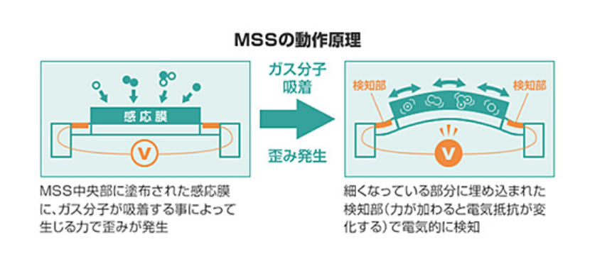
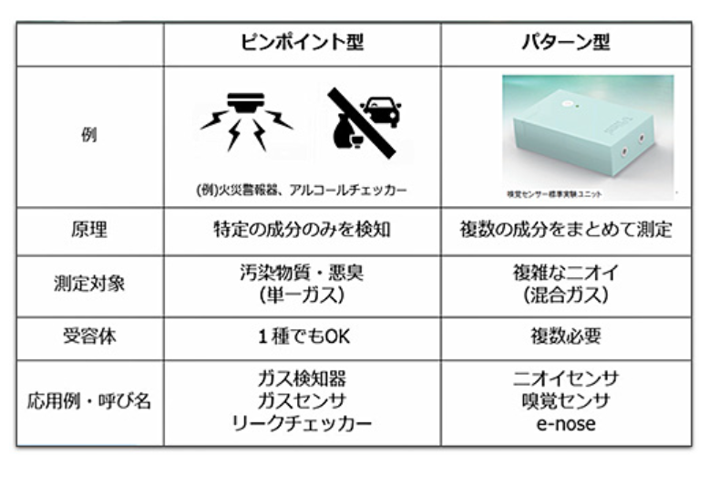

# 異臭検知
強く香る臭いを検知し、さらにその臭いを識別するシステムについて調査を実施

## 1.事例　共振型マルチモーダルセンサ（2019）
振動子の共振を利用し、さまざまなにおいを検知可能なマルチモーダルセンサを開発しました。振動子上に臭い分子を吸着する複数の感応膜を形成し、実環境にある食品等のにおい検知に成功しました。

## 2.事例　MSS嗅覚IoTセンサー（2019）
京セラは、産官学共同研究プロジェクト（MSSフォーラム）に参加し、ニオイや香りの判別を可能とするMSS嗅覚IoTセンシング技術の開発を行ってきました。MEMSセンサーアレイ上に複数種の感応膜を設けてセンサーを構成。感応膜反応のパターン解析を行うことにより40万種といわれているニオイや香りの判別が可能になります。

本技術は産官学共同研究プロジェクト（MSSフォーラム）で実証実験され、40社以上が検証を行い、有効な用途や計測方法が見つかった企業様と共同研究段階に進んでおります。今後研究ベースから実装環境への開発を企業様と進めてまいりたいと考えております。
また「MSS嗅覚IoTセンサー」技術を構成する各要素技術を、より簡便に製品化構想につなげられるよう部品化・モジュール化、ソリューション化を目指し、さらには、計測・解析・データベース提供サービスをも視野に入れた基盤技術研究開発が行われています

## 3.事例　AI Olfactory Sensor(2024)
生物の嗅覚を模倣したにおいセンサです。センサで得た情報（出力値）をイメージ化し、AIアルゴリズムを用いてデータ解析することで、においを判別します。シャープのディスプレイの基板技術にAI（人工知能）をうまく活用することで、、低コストと高い判定精度を実現しています。応用例として、五感（嗅覚）に頼ることが多かったワインや香水などのにおいを可視化することで、品質管理を容易にすることなどが考えられます。

展示会ではワインの銘柄を判定するデモを行いましたが、お酒だと、実はある酒造メーカーと、日本酒の品質を管理するシステムを共同で開発しています。酒造メーカーの方にお聞きすると、お酒の味の7～8割はにおいで決まってくるそうで、重要なファクターです。しかし出来上がった日本酒を市場に出していいか、においで判定する検査（出荷判定検査）は、今でも人がやっているそうで、その部分に手間や熟練度を必要とします。また、人の判定はその時の健康状態などにも影響を受けます。「AI Olfactory Sensor」は、この部分を補うことで、品質管理の定量化と効率化を支援します。ある出荷判定の検証では、「AI Olfactory Sensor」は、出荷判定のスペシャリストの判定に対して、平均95.2％の正解率が得られました

### 参考文献
1.共振型マルチモーダルセンサ　山形県工業技術センターシーズ集 電子情報システム部 MEMS グループ(2019)
https://yrit.jp/wp-content/uploads/2021/12/R2_3MEMS_2_kyousin.pdf

2.MSS嗅覚IoTセンサー 京セラホームページ(2019)
https://www.kyocera.co.jp/rd-openinnovation/catalog/mss.html

3.AI Olfactory Sensor sharp blog(2024)
https://blog.jp.sharp/2024/01/26/43231/?_gl=1*qmnkfd*_ga*MTI4NzMxOTg1My4xNzU2OTQ3ODE1*_ga_H2QK7TN0BN*czE3NTY5Njg1NTIkbzMkZzEkdDE3NTY5Njg3OTkkajYwJGwwJGgw*_ga_376DXJ05P6*czE3NTY5Njg1NTIkbzMkZzEkdDE3NTY5Njg3OTkkajYwJGwwJGgw*_ga_E9NZ25ZMZ0*czE3NTY5Njg1NTIkbzMkZzEkdDE3NTY5Njg3OTkkajYwJGwwJGgw*_ga_6MQ8VF2DKW*czE3NTY5Njg1NTIkbzMkZzEkdDE3NTY5Njg3OTkkajYwJGwwJGgw